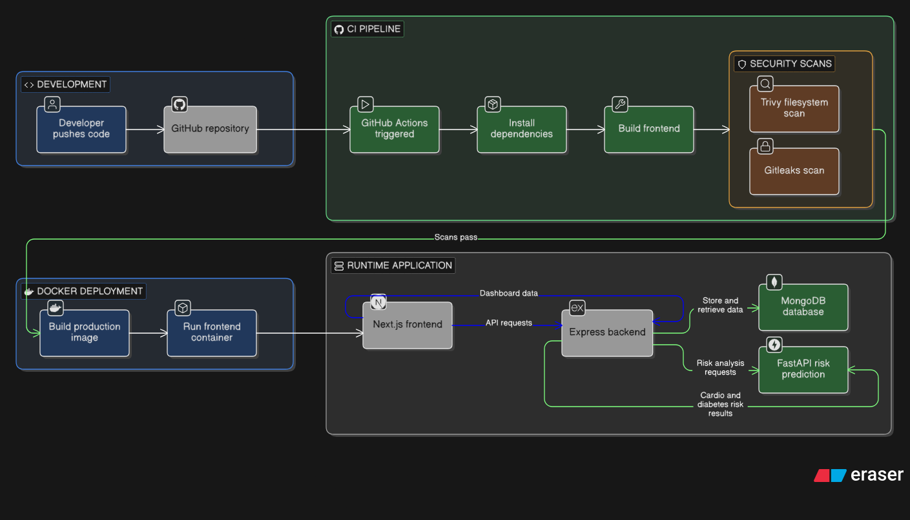

# Healthcare Risk Management Platform

This repository contains a full-stack healthcare application with:

- a `Next.js` frontend for doctors and patients
- an `Express.js` backend with JWT authentication and MongoDB
- a `FastAPI` risk prediction service for cardiovascular and diabetes assessment
- a `Dockerfile` for containerizing the frontend
- a `GitHub Actions` workflow for frontend build and security scanning

This project was not built from scratch by the current maintainer. The main work added in this repository update is the CI workflow and the Docker setup around the existing application.

## Overview

The application is designed around a doctor and patient workflow:

- doctors can register, log in, manage patients, update health data, and create appointments
- patients can register, log in, and access patient-facing dashboard features
- patient clinical data is sent to a Python prediction service to calculate cardio and diabetes risk
- risk output is stored in MongoDB and surfaced back through the application

## Architecture



```text
Next.js Frontend
      |
      v
Express Backend  ----->  MongoDB
      |
      v
FastAPI Risk Predictor
```

## Key Features

- Doctor and patient authentication with JWT
- Doctor dashboard with:
  - assigned patient counts
  - today's appointments
  - high-risk patient tracking
  - upcoming appointments
- Patient management:
  - add new patients
  - update lab/profile data
  - add medications
  - recompute risk for existing patients
- Appointment management for doctors
- Upload support through `/uploads`
- ML-backed prediction for:
  - cardiovascular risk
  - diabetes risk
- Frontend Docker build using multi-stage Next.js standalone output

## Tech Stack

- Frontend: `Next.js 15`, `React 19`, `Axios`, `Framer Motion`
- Backend: `Node.js`, `Express`, `MongoDB`, `Mongoose`, `JWT`, `Multer`
- ML API: `FastAPI`, `Pydantic`, `NumPy`, `joblib`
- DevOps: `Docker`, `GitHub Actions`, `Trivy`, `Gitleaks`

## Repository Structure

```text
.
├── frontend/                 # Next.js frontend
├── backend/                  # Express API and MongoDB integration
├── models-api/               # FastAPI risk prediction service and trained models
├── .github/workflows/ci.yaml # CI pipeline
├── Dockerfile                # Frontend production image
└── .env.example              # Example environment values
```

## Environment Variables

Copy `.env.example` and replace the values with your own secrets and local endpoints.

Example variables currently used by the project:

```env
BACKEND_PORT=5000
FRONTEND_PORT=80
MONGO_URL=your_mongodb_connection_string
JWT_SECRET=your_jwt_secret
JWT_EXPIRES_IN=1d
RISK_PREDICTOR_URL=http://127.0.0.1:8000/api/patient/add
NEXT_PUBLIC_API_URL=http://localhost:5000
IMAGE_REGISTRY=ghcr.io/your-account
IMAGE_TAG=latest
```

Notes:

- `backend/server.js` requires `MONGO_URL` and `JWT_SECRET`
- the frontend reads `NEXT_PUBLIC_API_URL` and appends `/api`
- the backend calls the Python service using `RISK_PREDICTOR_URL`
- the sample `.env.example` in the repo should be treated as placeholder configuration and updated before use

## Local Development

### 1. Frontend

```bash
cd frontend
npm ci
npm run dev
```

Default dev server: `http://localhost:3000`

### 2. Backend

```bash
cd backend
npm ci
npm run dev
```

If you want to run without `nodemon`:

```bash
node server.js
```

Default backend port: `5000`

### 3. Risk Prediction API

Create a Python environment, install dependencies, then start FastAPI:

```bash
cd models-api/src
pip install -r requirements.txt
uvicorn fastapi_app:app --reload --host 0.0.0.0 --port 8000
```

Health endpoint:

```bash
GET http://127.0.0.1:8000/health
```

## Docker

The root `Dockerfile` builds the `frontend` application only.

Build:

```bash
docker build -t healthcare-frontend .
```

Run:

```bash
docker run -p 3000:3000 healthcare-frontend
```

What this image does:

- installs frontend dependencies
- builds the Next.js app in standalone mode
- runs the production server with `node server.js`

## API Summary

Main backend route groups:

- `/api/auth`
  - doctor register/login
  - patient register/login
- `/api/dashboard`
  - dashboard counts and doctor overview data
- `/api/doctor`
  - doctor-related endpoints
- `/api/appointment`
  - appointment creation and retrieval
- `/api/availability`
  - doctor availability management
- `/api/patient`
  - patient creation, updates, medication, and risk operations

Main ML API endpoints:

- `GET /health`
- `POST /api/patient/add`

## Machine Learning Service

The Python service loads trained models from `models-api/models/`:

- `cardio_risk_rf.joblib`
- `cardio_scaler.joblib`
- `diabetes_rf.joblib`
- `diabetes_scaler.joblib`

If model files are unavailable, the API falls back to heuristic risk scoring so the app can still respond.

## CI/CD And Docker Work Added

The repository includes [`.github/workflows/ci.yaml`](./.github/workflows/ci.yaml), which currently runs on pushes and pull requests to `master`.

Current workflow steps:

- build job
  - checks out the repository
  - sets up Node.js `20`
  - installs frontend dependencies with `npm ci`
  - builds the frontend app
- security job
  - runs a Trivy filesystem scan
  - runs a Gitleaks scan

The root [Dockerfile](./Dockerfile) was added to containerize the `frontend` application using a multi-stage Next.js standalone build.

## Important Notes

- this repository documents an existing healthcare application; the primary additions made here are the GitHub Actions workflow and Docker support
- `backend/node_modules` is currently present in the repository; it is usually better to exclude dependencies from version control
- the root Docker image does not currently containerize the backend or FastAPI service
- the CI workflow currently validates the frontend only; backend tests and Python checks are not yet part of the pipeline

## License

This project is licensed under the `MIT` License. See [LICENSE](./LICENSE).
